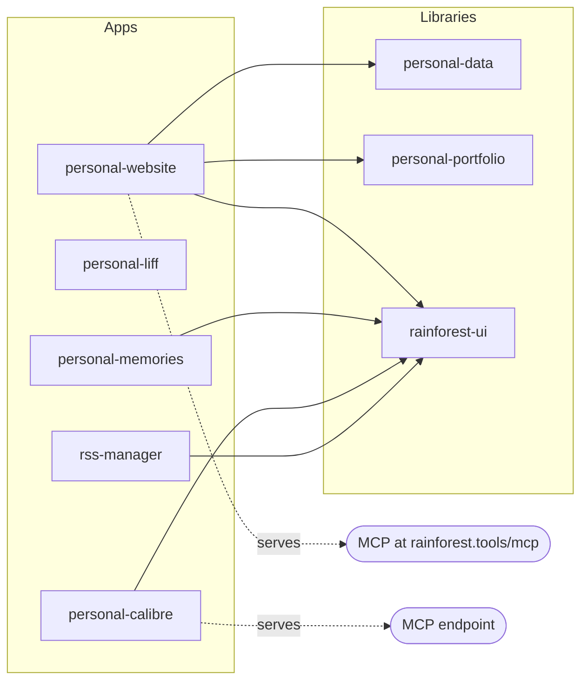
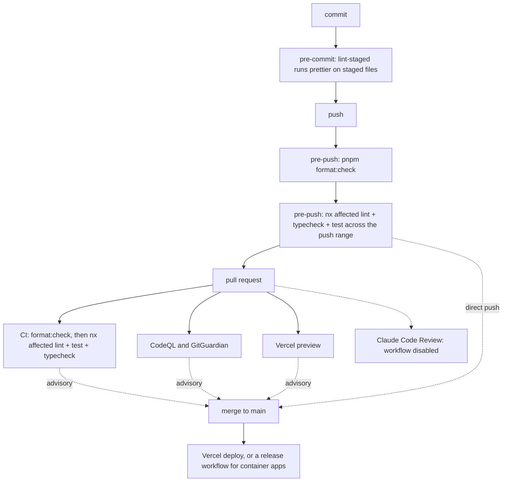

# Rainforest's monorepo

Everything behind [rainforest.tools](https://rainforest.tools) lives here: the site itself, a few
small services that share its design system, and the libraries underneath them. Nx manages the
project graph, pnpm manages the workspace.

[](https://rainforest.tools)
[](https://nx.dev)
[](https://pnpm.io/)

## What is in here

| App                                              | What it does                                                                                                        |
| ------------------------------------------------ | ------------------------------------------------------------------------------------------------------------------- |
| [`personal-website`](./apps/personal-website/)   | The Astro site: resume, blog, case studies, and an MCP server at `/mcp` that serves the same profile data to agents |
| [`personal-liff`](./apps/personal-liff/)         | A LINE mini-app, built on Next.js and the LIFF SDK                                                                  |
| [`personal-calibre`](./apps/personal-calibre/)   | Ebook library service, with its own MCP endpoint                                                                    |
| [`personal-memories`](./apps/personal-memories/) | Photo album, deployed to the homelab as a container image                                                           |
| [`rss-manager`](./apps/rss-manager/)             | Feed collection and triage                                                                                          |

`personal-calibre`, `personal-liff` and `personal-memories` each have a sibling `*-e2e` project
running Playwright against them.

| Library                                                            | What it holds                                                                                  |
| ------------------------------------------------------------------ | ---------------------------------------------------------------------------------------------- |
| [`@rainforest-dev/personal-data`](./libs/personal-data/)           | Profile, work history and project data, typed once and read by both the site and the MCP tools |
| [`@rainforest-dev/personal-portfolio`](./libs/personal-portfolio/) | Case study content and the MCP registrations that expose it                                    |
| [`@rainforest-dev/rainforest-ui`](./libs/rainforest-ui/)           | Shared components, built with Lit and Tailwind, documented in Storybook                        |



## How changes get in

Most commits here are written by an agent. In the ninety days to 2026-09-22 that was 240 commits
on `main`, 203 of them conventional. Volume like that is only reviewable if the local hooks and CI
check the same things, so the hooks mirror CI rather than inventing rules of their own.

Every check after the push is advisory. The only ruleset on `main` blocks deletion and force
pushes. No check has to pass, no pull request is required, and direct pushes to `main` are
allowed. The Claude Code Review workflow is disabled in this repository.



Two decisions in there are deliberate and easy to undo by accident.

`build` is not one of the pre-push targets, because building inside a git worktree corrupts the
shared `.nx` cache. That does not keep every build out of pre-push: `personal-website`'s `test` and
`typecheck` targets depend on `^build`, so a push that affects the site still builds
`personal-data`, `personal-portfolio` and `rainforest-ui` first. App builds happen in the Vercel
previews and the release workflows, not in CI. Lint, typecheck and test catch nearly everything
before a push spends a runner.

`pnpm format:check` is a CI step of its own, separate from `nx affected`, because prettier covers
files that no Nx project owns. It is also the step that failed on PR #342, the first pull request
this repo's loop opened unattended: the formatter documented in `CLAUDE.md` had simply never been
run. Formatting on the way in means that failure cannot be authored again.

The pre-push hook hands over to the worktree's own copy of itself before running. Agent worktrees
inherit an absolute `core.hooksPath` pointing at the main clone, so without the handover git would
check this worktree's files using whatever branch that other checkout happens to have. Worktrees
are the normal case here, not an edge one.

In a genuine emergency, `git push --no-verify` skips the pre-push checks, which are the heavy gate.
`git commit --no-verify` only skips the pre-commit formatter. Say so in the pull request if you use
either. A silent skip and an absent gate look the same afterwards.

## Running it locally

Node 22 and pnpm 11 are what the workspace expects. `engines` and `packageManager` in
`package.json` are the source of truth if this drifts.

```bash
pnpm install

pnpm nx dev personal-website          # or personal-liff, personal-calibre, ...
pnpm nx run-many -t lint typecheck test --projects=personal-website
pnpm nx affected -t lint typecheck test
```

`pnpm nx graph` draws the real dependency graph, which will be more current than the diagram
above.

## Agent instructions

`AGENTS.md` and `CLAUDE.md` carry the contract for agents working in this repo: the commit and
push gates, how to attach visual evidence to a pull request, and the comment allow-list that keeps
rationale in pull request descriptions instead of in the source.
