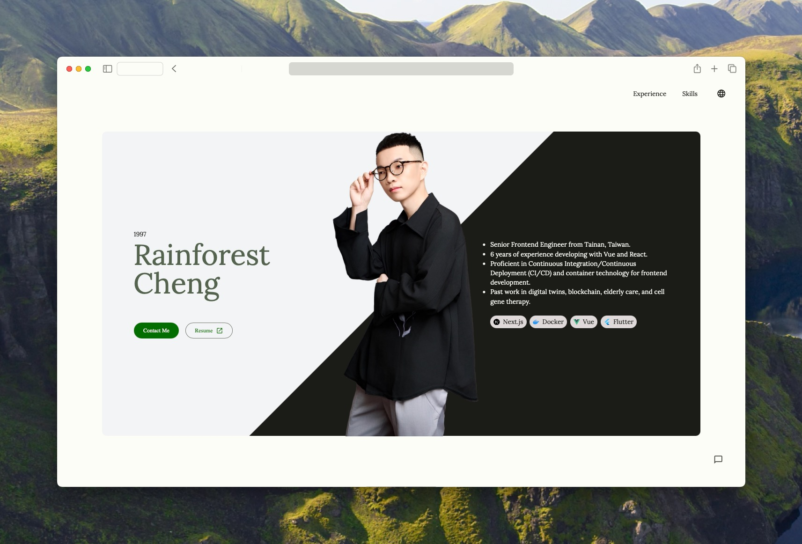

# Rainforest's Personal Website



## 🚀 Project Structure

Inside of your Astro project, you'll see the following folders and files:

```text
/
├── public/
│   └── favicon.svg
├── src/
│   ├── components/
│   │   ├── blog/demo/: components specific for blog posts
│   │   └── Card.astro
│   ├── layouts/
│   │   ├── blog.astro
│   │   └── index.astro: base layout component
│   └── pages/
│       ├── blog/
│       ├── posts/
│       ├── resume.astro
│       └── index.astro
└── astro.config.mjs
```

Astro looks for `.astro` or `.md` files in the `src/pages/` directory. Each page is exposed as a route based on its file name.

There's nothing special about `src/components/`, but that's where we like to put any Astro/React/Vue/Svelte/Preact components.

Any static assets, like images, can be placed in the `public/` directory.

## Development

You can manage the development of this project using [Nx vscode extension](https://marketplace.visualstudio.com/items?itemName=nrwl.angular-console).

or using the following command:

```sh
nx run personal-website:dev
```

## 🧞 Commands

All commands are run from the root of the project, from a terminal:

| Command                   | Action                                           |
| :------------------------ | :----------------------------------------------- |
| `npm install`             | Installs dependencies                            |
| `npm run dev`             | Starts local dev server at `localhost:4321`      |
| `npm run build`           | Build your production site to `./dist/`          |
| `npm run preview`         | Preview your build locally, before deploying     |
| `npm run astro ...`       | Run CLI commands like `astro add`, `astro check` |
| `npm run astro -- --help` | Get help using the Astro CLI                     |
