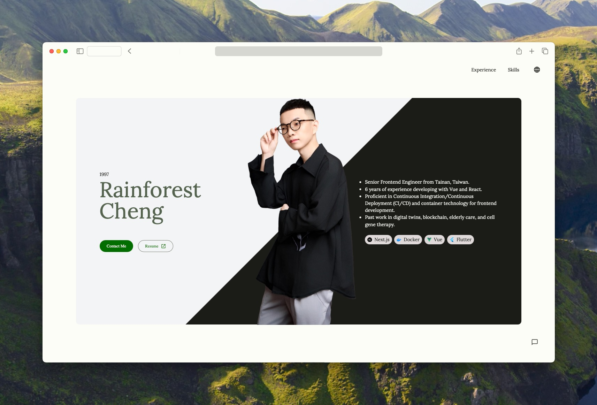

# 🌟 Rainforest's Personal Website

> A cutting-edge personal portfolio powered by Astro with AI/ML capabilities, multi-framework support, and progressive web app features

[](https://rainforest.tools)
[](https://astro.build)
[](https://www.typescriptlang.org/)
[](https://web.dev/progressive-web-apps/)



## ✨ Features

### 🚀 Core Features
- **⚡ Astro-powered** - Lightning-fast static site generation with component islands
- **🎨 Multi-framework** - React, Vue, and Lit components working together seamlessly  
- **📱 Progressive Web App** - Offline support, app-like experience
- **🌍 Internationalization** - Multi-language support with i18next
- **🤖 AI/ML Integration** - Web LLM capabilities for intelligent interactions
- **📊 Math Rendering** - KaTeX support for mathematical expressions
- **📝 MDX Content** - Rich content authoring with React components

### 🎯 Advanced Capabilities
- **🧠 Web AI** - Client-side AI models with @mlc-ai/web-llm
- **🎨 Material Design 3** - Google's latest design system
- **📊 Analytics** - Vercel Speed Insights integration
- **🔍 SEO Optimized** - Sitemap, RSS feeds, and meta optimization
- **♿ Accessibility** - WCAG compliant with semantic HTML
- **🌙 Theme Support** - Dark/light mode with system preference detection

## 🏗️ Architecture

### Technology Stack

**Core Framework**
- **Astro 5.7** - Modern static site generator
- **TypeScript 5.8** - Type-safe development
- **Vite** - Fast build tooling

**UI Frameworks**
- **React 19** - Interactive components and client-side features
- **Vue 3.5** - Reactive components with Composition API
- **Lit 3.3** - Lightweight web components
- **@rainforest-dev/rainforest-ui** - Custom component library

**Styling & Design**
- **Tailwind CSS 4.1** - Utility-first CSS framework
- **Material Design 3** - Google's design system
- **@tailwindcss/typography** - Beautiful typographic defaults

**Advanced Features**
- **@mlc-ai/web-llm** - Client-side AI/ML capabilities
- **i18next** - Internationalization framework
- **Nanostores** - Tiny state management
- **PWA** - Service worker and offline capabilities

## 🚀 Getting Started

### Prerequisites

- Node.js >= 18.0.0
- pnpm >= 8.0.0

### Development Setup

```bash
# From monorepo root
pnpm install

# Start development server
nx dev personal-website

# Or with custom host binding
nx dev personal-website --host=0.0.0.0
```

The development server will be available at `http://localhost:4321`

### Environment Variables

Create a `.env.local` file in the app directory:

```bash
# Analytics (optional)
VERCEL_ANALYTICS_ID=your_analytics_id

# AI/ML Configuration (optional)
WEBLLM_MODEL_URL=your_model_url

# Internationalization
PUBLIC_DEFAULT_LOCALE=en
PUBLIC_SUPPORTED_LOCALES=en,zh-TW
```

## 📁 Project Structure

```
apps/personal-website/
├── src/
│   ├── components/           # Reusable components
│   │   ├── blog/            # Blog-specific components
│   │   ├── ui/              # UI components
│   │   └── ai/              # AI-powered components
│   ├── layouts/             # Page layouts
│   │   ├── base.astro       # Base HTML layout
│   │   ├── blog.astro       # Blog post layout
│   │   └── index.astro      # Homepage layout
│   ├── pages/               # File-based routing
│   │   ├── blog/            # Blog pages
│   │   ├── posts/           # Blog posts in MDX
│   │   ├── resume.astro     # Resume page
│   │   └── index.astro      # Homepage
│   ├── content/             # Content collections
│   ├── styles/              # Global styles
│   └── utils/               # Utility functions
├── public/                  # Static assets
│   ├── images/             # Image assets
│   ├── icons/              # App icons for PWA
│   └── manifest.json       # PWA manifest
├── astro.config.mjs        # Astro configuration
├── tailwind.config.mjs     # Tailwind configuration
└── tsconfig.json           # TypeScript configuration
```

## 🛠️ Development

### Available Scripts

| Command | Description |
|---------|-------------|
| `nx dev personal-website` | Start development server |
| `nx build personal-website` | Build for production |
| `nx preview personal-website` | Preview production build |
| `nx check personal-website` | Run Astro type checking |

### Adding New Content

#### Blog Posts

Create MDX files in `src/pages/posts/`:

```mdx
---
title: "Your Post Title"
description: "Post description"
date: "2025-06-29"
tags: ["tech", "development"]
---

# Your Post Title

Your content here with MDX support!

<MyComponent prop="value" />
```

#### Pages

Create `.astro` files in `src/pages/`:

```astro
---
// Page frontmatter (TypeScript)
import Layout from '../layouts/base.astro';
---

<Layout title="Page Title">
  <h1>Your Page Content</h1>
</Layout>
```

### Component Development

#### React Components

```typescript
// src/components/MyReactComponent.tsx
import { useState } from 'react';

export default function MyReactComponent() {
  const [count, setCount] = useState(0);
  
  return (
    <button onClick={() => setCount(count + 1)}>
      Count: {count}
    </button>
  );
}
```

#### Vue Components

```vue
<!-- src/components/MyVueComponent.vue -->
<template>
  <button @click="increment">
    Count: {{ count }}
  </button>
</template>

<script setup lang="ts">
import { ref } from 'vue';

const count = ref(0);
const increment = () => count.value++;
</script>
```

#### Lit Components

```typescript
// src/components/MyLitComponent.ts
import { LitElement, html, css } from 'lit';
import { customElement, property } from 'lit/decorators.js';

@customElement('my-lit-component')
export class MyLitComponent extends LitElement {
  @property({ type: String })
  message = 'Hello World';

  render() {
    return html`<p>${this.message}</p>`;
  }
}
```

## 🌐 Internationalization

The site supports multiple languages using i18next:

### Adding Translations

1. Add translation files in `src/locales/`:

```javascript
// src/locales/en.json
{
  "nav": {
    "home": "Home",
    "blog": "Blog",
    "resume": "Resume"
  }
}

// src/locales/zh-TW.json
{
  "nav": {
    "home": "首頁",
    "blog": "部落格", 
    "resume": "履歷"
  }
}
```

2. Use translations in components:

```astro
---
import { t } from '../utils/i18n';
---

<nav>
  <a href="/">{t('nav.home')}</a>
  <a href="/blog">{t('nav.blog')}</a>
</nav>
```

## 🤖 AI/ML Features

### Web LLM Integration

The site includes client-side AI capabilities:

```typescript
// Example usage in a component
import { WebLLM } from '@mlc-ai/web-llm';

const initializeAI = async () => {
  const engine = new WebLLM();
  await engine.reload('llama-2-7b-chat-q4f32_1');
  
  const response = await engine.chat([
    { role: 'user', content: 'Hello, AI!' }
  ]);
  
  return response;
};
```

### AI-Powered Components

The site includes several AI-enhanced components:
- **Smart Search** - Semantic content search
- **Content Generation** - Dynamic content creation
- **Interactive Chat** - Real-time AI conversations

## 🎨 Styling Guide

### Tailwind CSS

The project uses Tailwind CSS 4.1 with custom configuration:

```javascript
// tailwind.config.mjs
export default {
  content: ['./src/**/*.{astro,html,js,jsx,md,mdx,svelte,ts,tsx,vue}'],
  theme: {
    extend: {
      colors: {
        primary: 'var(--color-primary)',
        secondary: 'var(--color-secondary)',
      }
    }
  }
}
```

### Material Design 3

Components use Material Design 3 principles:

```astro
<md-filled-button>Primary Action</md-filled-button>
<md-outlined-button>Secondary Action</md-outlined-button>
```

## 📱 Progressive Web App

### PWA Features

- **Offline Support** - Service worker caching
- **App-like Experience** - Native app behavior
- **Install Prompt** - Add to home screen
- **Background Sync** - Offline form submission

### Manifest Configuration

```json
// public/manifest.json
{
  "name": "Rainforest's Portfolio",
  "short_name": "Rainforest",
  "description": "Personal portfolio with AI capabilities",
  "start_url": "/",
  "display": "standalone",
  "theme_color": "#000000",
  "background_color": "#ffffff"
}
```

## 🚀 Deployment

### Build Process

```bash
# Production build
nx build personal-website

# Build outputs to dist/
```

### Vercel Deployment

The site is automatically deployed to Vercel:

1. **Automatic** - Push to main branch triggers deployment
2. **Preview** - Pull requests get preview deployments
3. **Analytics** - Speed insights and Web Vitals tracking

### Environment Configuration

Production environment variables:

```bash
# Vercel environment variables
VERCEL_ANALYTICS_ID=prod_analytics_id
PUBLIC_SITE_URL=https://rainforest.tools
```

## 🧪 Testing

### Type Checking

```bash
# Run Astro type checking
nx check personal-website
```

### Manual Testing

1. **Performance** - Lighthouse scores > 90
2. **Accessibility** - WCAG AA compliance
3. **PWA** - Manifest and service worker validation
4. **Cross-browser** - Chrome, Firefox, Safari, Edge

## 🔧 Configuration

### Astro Configuration

Key configuration in `astro.config.mjs`:

```javascript
export default defineConfig({
  integrations: [
    react(),
    vue(),
    lit(),
    mdx(),
    sitemap(),
    vercel({
      speedInsights: { enabled: true }
    })
  ],
  vite: {
    plugins: [VitePWA(pwaConfig)]
  }
});
```

### Performance Optimization

- **Image Optimization** - Astro's built-in image processing
- **Bundle Splitting** - Automatic code splitting
- **Preloading** - Critical resource preloading
- **Compression** - Gzip/Brotli compression

## 🤝 Contributing

See the main [Contributing Guide](../../CONTRIBUTING.md) for general guidelines.

### Website-Specific Guidelines

1. **Content** - Use MDX for blog posts with proper frontmatter
2. **Components** - Prefer Astro components for static content
3. **Interactivity** - Use React/Vue/Lit for dynamic features
4. **Performance** - Maintain Lighthouse scores above 90
5. **Accessibility** - Test with screen readers and keyboard navigation

## 📚 Resources

### Documentation
- [Astro Documentation](https://docs.astro.build)
- [Material Design 3](https://m3.material.io)
- [Tailwind CSS](https://tailwindcss.com)
- [i18next](https://www.i18next.com)

### Tools
- [Astro DevTools](https://github.com/withastro/language-tools)
- [PWA Builder](https://www.pwabuilder.com)
- [Lighthouse](https://developers.google.com/web/tools/lighthouse)

---

**Built with modern web technologies and ❤️**
